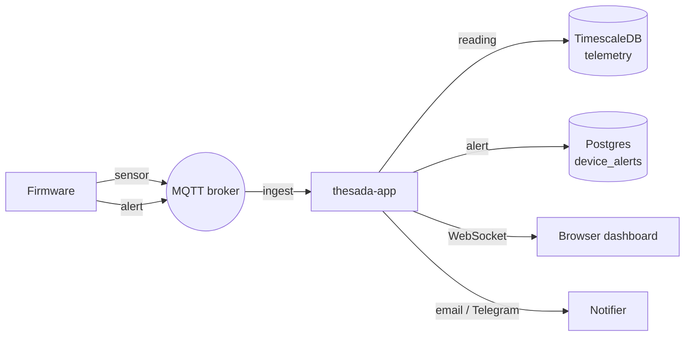

# Architecture

thesada-app is the Go web application at the centre of the platform. It ingests device telemetry from MQTT, persists it to Postgres/TimescaleDB, serves a web dashboard and a JSON API, and dispatches alerts. Firmware behaviour is documented under [Firmware]({{ site.baseurl }}/firmware/); this page covers the server side and how the pieces connect.

## Components

| Component | Repo | Language | What it owns |
|---|---|---|---|
| thesada-app | thesada-app | Go | Web dashboard (HTMX), JSON API (`/api/v1`), MQTT ingest, alerting, auth, the internal per-device certificate authority |
| Firmware | thesada-fw | C++ (ESP32) | Sensor reads, connectivity; publishes telemetry and alerts to MQTT, accepts config and command downlinks |
| MQTT broker | Mosquitto | C | Message bus for all device and app traffic; dynamic-security ACLs |
| Database | PostgreSQL + TimescaleDB | SQL | All platform state; a telemetry hypertable with continuous aggregates |
| Edge | Reverse proxy | - | Public TLS termination; MQTT TLS and mTLS ingress |

## Data flow

### Telemetry

1. Firmware publishes a reading to `<prefix>/sensor/<metric>` - a bare number, a string, or a `{ "value": ... }` object.
2. The app holds one wildcard MQTT subscription (QoS 1). On each message it taps the raw bytes (for the admin shell), parses tenant, device, and kind from the topic, and validates the tenant.
3. Sensor messages bump the device's `last_seen` and insert a row into the `device_telemetry` hypertable.
4. A WebSocket event fans out to every browser open on that tenant, so the dashboard updates live.

### Alerts

1. A Lua rule on the device publishes a JSON alert to `<prefix>/alert` (`severity` is `info`, `warn`, or `crit`, plus `code` and `message`). Malformed or unknown-severity payloads are dropped.
2. The app inserts the event into `device_alerts` and pushes a live WebSocket event.
3. A background dispatcher matches alert subscriptions - per device or tenant-wide, each with a minimum-severity threshold - and sends email and/or Telegram. Delivery flags are set idempotently so retries never double-send.

## Where state lives

All persistent state is in PostgreSQL (with the TimescaleDB extension). Tenant isolation is enforced by Postgres row-level security (RLS) as the steady-state default: the app sets a per-transaction tenant identifier, so every query is automatically scoped to one tenant.

| Data | Store | Tenant isolation |
|---|---|---|
| Devices, users, sessions, API tokens | Postgres | RLS (direct column or via a foreign key) |
| Telemetry (raw readings) | TimescaleDB hypertable | application-enforced (see below) |
| Telemetry rollups | continuous aggregates (hourly, daily) | derived from telemetry |
| Alerts and subscriptions | Postgres | RLS via device / user foreign key |
| Device files and change history | Postgres | RLS |
| OAuth providers and identities | Postgres | RLS |
| Tenant registry | Postgres | none - cross-tenant by definition; read via an admin path or a slug cache |

**Telemetry is the one exception to RLS.** TimescaleDB rejects row-level security on a compression-enabled hypertable, so `device_telemetry` carries no policy. Isolation is enforced in the application instead: every telemetry read filters by `device_pk`, and a `device_pk` is only obtainable through a `devices` lookup that *is* RLS-scoped.

### Database roles

The app connects with three role-scoped pools:

| Pool | Role | Used for |
|---|---|---|
| App | tenant role, RLS enforced | the majority of reads and writes, scoped by the tenant identifier |
| Admin | bypass-RLS role | cross-tenant and pre-tenant work (migrations, session and token validation, aggregate refresh); every use is audit-logged |
| MQTT | ingest role | the telemetry subscriber, with narrow grants on its own connection budget |

## Deployment

The app, database, and broker run as one Docker Compose stack; CI builds and rolls it:

1. Build a versioned image, CVE-scan it (report-only), push to the registry.
2. Run database migrations in a one-shot container against the live database - a broken migration aborts here, with the old app still serving.
3. `docker compose up -d` swaps in the new image.
4. A healthcheck (`/api/v1/healthz`) and a login/redirect smoke test gate the release; on failure CI rolls back to the previous image automatically.

A TLS-terminating reverse proxy fronts the public endpoints. It terminates TLS for the web app, the OTA server, and the MQTT TLS port, and passes the MQTT mTLS port straight through so client certificates reach the broker.
