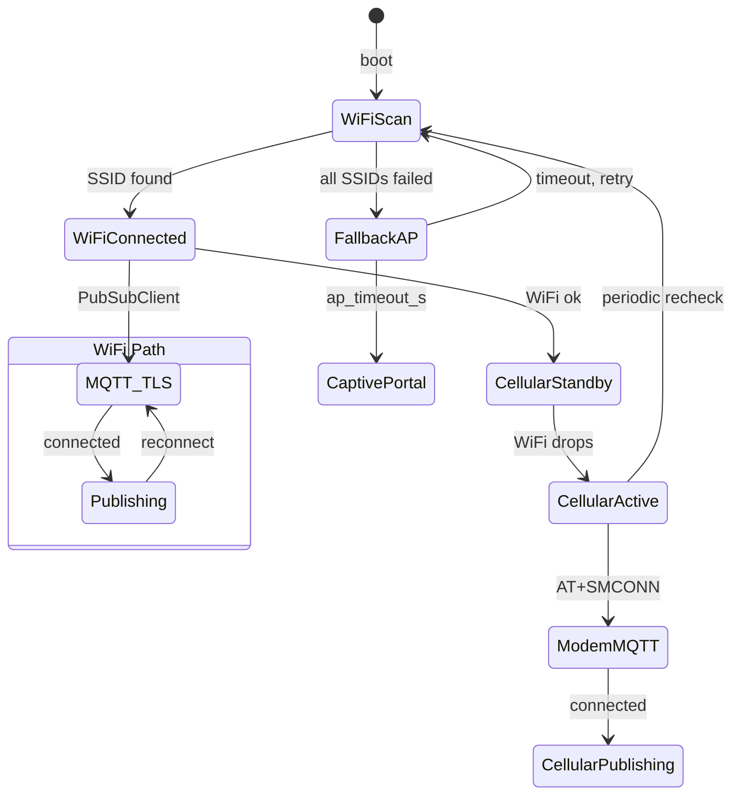
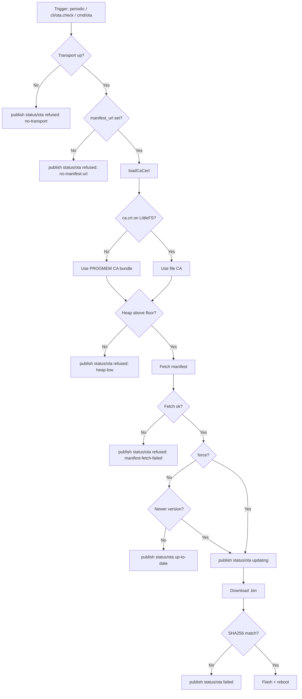

# Connectivity & OTA

## Connectivity State Machine



WiFi is always tried first. Each SSID is retried up to `wifi.retries` times (default 2) before moving on. If no WiFi network is in range, the fallback AP starts a captive portal for local configuration. Cellular activates in parallel when WiFi fails.

## OTA Update (OTAUpdate)

HTTP(S) pull-based OTA. The device fetches a JSON manifest, compares semver, and streams + verifies the firmware binary.



**Manifest format** (`build/firmware.json`, generated by `scripts/generate_manifest.py`):
```json
{
  "version": "1.x",
  "url": "https://example.com/firmware.bin",
  "sha256": "abc123..."
}
```

**Triggers:**
1. Periodic interval check (default 6 h, configurable via `ota.check_interval_s`)
2. First check runs 30 seconds after boot
3. Shell command `ota.check [--force] [url]` - over serial, WebSocket, HTTP POST `/api/cmd`, or MQTT CLI topic `<prefix>/cli/ota.check`
4. MQTT message to `ota.cmd_topic` (any payload) - defaults to `<topic_prefix>/cmd/ota`

Trigger over MQTT CLI (recommended - no external scripts, response on `<prefix>/cli/response`):
```bash
# use config manifest_url, version check
mosquitto_pub ... -t '<prefix>/cli/ota.check' -m ''

# use config manifest_url, skip version check (re-flash same or older)
mosquitto_pub ... -t '<prefix>/cli/ota.check' -m '--force'

# use override URL, version check
mosquitto_pub ... -t '<prefix>/cli/ota.check' -m 'https://example.com/firmware.json'

# use override URL, force re-flash
mosquitto_pub ... -t '<prefix>/cli/ota.check' -m '--force https://example.com/firmware.json'
```

Force mode bypasses `isNewer()` so dev iteration does not need a `FIRMWARE_VERSION` bump every test cycle. Intended for development and for recovering a stuck device without version juggling.

**Watchdog-safe download loop**: the per-chunk download path feeds the task watchdog after each `Update.write()` and uses short socket + handshake timeouts (10 s) on the local `WiFiClientSecure`. This prevents a slow `readBytes()` on a flaky upstream from blocking the client past the ~5 s task watchdog window and panic-rebooting mid-flash. Required for OTA reliability on weak wireless links.

**TLS:** loads `/ca.crt` from LittleFS. If the file is missing or empty, the OTA client falls back to a PROGMEM bundle of common public TLS roots baked into the firmware. The OTA path stays cert-validated even when the LittleFS data partition has been wiped.

**config.json keys:**
```json
"ota": {
  "enabled":          true,
  "manifest_url":     "https://github.com/Thesada/thesada-fw/releases/latest/download/firmware.json",
  "check_interval_s": 21600,
  "cmd_topic":        "thesada/node/cmd/ota"
}
```

---

## MQTT Subscriptions

`MQTTClient::subscribe(topic, callback)` stores subscriptions and re-applies them automatically on reconnect. Callbacks are dispatched by exact topic match or trailing `/#` wildcard in `onMessage()`.

### MQTT CLI

The primary interface for remote management. Subscribe to `<prefix>/cli/#` - the topic is the command, the payload is the arguments. Response published to `<prefix>/cli/response` as JSON.

```
thesada/node/cli/sensors          payload: ""              -> all sensors
thesada/node/cli/sensors          payload: "temp_1"        -> specific sensor
thesada/node/cli/config.set       payload: "mqtt.ha_discovery true"
thesada/node/cli/config.reload    payload: ""
thesada/node/cli/ota.check        payload: ""
thesada/node/cli/restart          payload: ""
thesada/node/cli/battery          payload: ""
thesada/node/cli/version          payload: ""
```

Response format:
```json
{"cmd": "sensors", "ok": true, "output": ["temp_1: 65.2C", "temp_2: 57.1C"]}
```

Any shell command works - same 30+ commands available over serial, WebSocket, HTTP, and now MQTT.

Binary write command: `cli/fs.write` - payload is `<path>\n<content>`. All three `mosquitto_pub` modes work (`-m`, `-f`, `-s`):
```bash
mosquitto_pub ... -t '<prefix>/cli/fs.write' -m '/test.txt
hello world'
```

The legacy `cli/file.write` alias still works for older clients. See [Chunked File I/O]({{ site.baseurl }}/firmware/chunked-io/) for the full write contract, chunking math, and concurrency notes.

**Notes:**
- All CLI commands execute in `loop()` via deferred processing (not inside the PubSubClient callback). This prevents keepalive timeouts on slow operations like LittleFS writes.
- `config.set` saves to flash and reloads in place atomically.
- Full config replacement: use `cli/fs.write` with path `/config.json` + `cli/config.reload`.

### Dedicated triggers vs the CLI bridge

`<prefix>/cmd/ota` is the only legacy dedicated trigger still wired up. Set `ota.cmd_topic` in `config.json` to enable it; any payload on the configured topic triggers an OTA check. Prefer the `cli/ota.check` path for normal use - it calls the same code path, accepts `--force`, and publishes its response to `<prefix>/cli/response` so failures are diagnosable instead of silent.

Modules and Lua scripts can add further subscriptions via `MQTTClient::subscribe()` or `MQTT.publish()` / `EventBus.subscribe()`.

---

## HA MQTT Auto-Discovery

On every MQTT connect, the firmware publishes retained discovery config messages to `homeassistant/sensor/<device_id>/...` and `homeassistant/binary_sensor/<device_id>/...`. Home Assistant picks these up automatically - no manual YAML sensor config needed.

Enabled by default. Disable with `mqtt.ha_discovery: false` in config.json.

Each sensor publishes on its own topic with a simple value (no JSON parsing needed by HA):

```
<prefix>/sensor/temperature/<slug>   -> "65.20"
<prefix>/sensor/current/<slug>       -> "0.70"
<prefix>/sensor/power/<slug>         -> "84.0"
<prefix>/sensor/battery/percent      -> "100"
<prefix>/sensor/battery/voltage      -> "4.19"
<prefix>/sensor/battery/charging     -> "Charging"
<prefix>/sensor/wifi/rssi            -> "-52"
<prefix>/sensor/wifi/ssid            -> "MyNetwork"
<prefix>/sensor/wifi/ip              -> "172.16.0.100"
<prefix>/status                      -> "online" / "offline" (LWT)
```

Discovery template is `{{value}}` for all entities. WiFi diagnostics are `entity_category: diagnostic` (disabled by default in HA).

Combined JSON payloads are still published on the original topics for backwards compatibility (Lua scripts, SD logging, cellular relay).

All entities are grouped under a single HA device (device name from `device.friendly_name`, manufacturer "Thesada", model "Base Node", sw_version from firmware).

No manual YAML sensor config needed - auto-discovery handles everything.

---

## MQTT Connection Reliability

Several mechanisms prevent connection drops after extended uptime:

**Connection watchdog** (10 min) - if no successful `_client.loop()` or publish in 10 minutes, the client force-disconnects and reconnects. Catches half-open TCP sockets that PubSubClient reports as connected.

**TCP keepalive** - enabled on the MQTT socket after connect via `setsockopt()`. Sends OS-level TCP probes after 30 s of silence, every 10 s, and declares dead after 3 failed probes. Detects NAT table timeouts and router reboots faster than MQTT-level keepalive.

**Telegram HTTPS timeout** - all outbound HTTPS requests (Telegram Bot API, webhooks) are capped at 10 s. Without this, a slow DNS lookup or TLS handshake can block `loop()` long enough for the MQTT keepalive (60 s) to expire.

**Persistent WiFiClientSecure** - the Telegram HTTPS client uses a static `WiFiClientSecure` instance instead of allocating a new one per request. Repeated new+delete of the ~30 KB TLS buffer fragments the heap beyond recovery on ESP32. The persistent instance avoids that and keeps Telegram reliable after extended uptime.

**NTP-aware TLS** - on a cold boot the system clock starts at epoch (Jan 1970), so certificate validation fails because every cert looks expired. MQTTClient connects insecure on cold boot, then forces a reconnect with cert validation once NTP syncs. Eliminates the ~10 minute initial connect delay seen when the client retries TLS handshakes against a bad clock.

**TLS heap guard** - the cert upgrade is skipped when free heap is below ~40 KB at connect time. `WiFiClientSecure`'s SSL allocation needs a large contiguous block; attempting it on a tight heap causes OOM crashes. The connection stays insecure with a warning logged.

Connection uptime is logged on disconnect to help diagnose patterns (consistent ~3600s = NAT timeout, random = WiFi instability).

---

## WiFi Path (normal)

- Multi-SSID: configure a list of networks; ranked by RSSI at scan time
- Configurable retries per SSID before fallback: `wifi.retries` (default 2)
- NTP synced on connect (`pool.ntp.org` by default, configurable)
- PubSubClient MQTT over TLS (port 8883)
- Optional minimum send interval: `mqtt.send_interval_s`
- Optional static IP: `wifi.static_ip` / `gateway` / `subnet` / `dns`

```json
"wifi": {
  "retries": 2
}
```

---

## Fallback AP (captive portal)

When no configured WiFi network is in range (or none are configured), the node starts a SoftAP for local configuration. Previously the firmware would skip straight to cellular fallback - now the AP always starts first so you can configure WiFi locally.

- **SSID:** `<device.name>-setup` (e.g. `thesada-owb-setup`)
- **Password:** from `wifi.ap_password` (min 8 chars for WPA2; open if empty or shorter)
- **Captive portal:** all DNS queries redirect to `192.168.4.1`, and unknown HTTP requests redirect to the dashboard. Phones and laptops auto-open the config page on connect.
- **Timeout:** after `wifi.ap_timeout_s` (default 300s) the AP stops and WiFi scan retries. This cycles until WiFi connects.

The web interface is fully functional in AP mode - you can view sensors, edit config, and upload firmware.

```json
"wifi": {
  "ap_password":  "my-setup-pass",
  "ap_timeout_s": 300
}
```

---

## Cellular Fallback (LTE-M/NB-IoT)

- Activates when all WiFi networks fail (in parallel with fallback AP)
- SIM7080G modem-native MQTT over TLS via AT+SM* commands
- Periodic WiFi recheck every 15 min (configurable); reverts to WiFi when available
- The modem uploads the same CA the WiFi path uses (`/ca.crt` if present, otherwise the firmware's PROGMEM bundle) via AT+SMSSL + AT+CSSLCFG CONVERT, so cellular MQTT is cert-validated end-to-end.

---

## CA Certificate

The firmware looks for `/ca.crt` on LittleFS first and uses the contents directly for both WiFi MQTT and OTA. Place a CA cert PEM bundle as `data/ca.crt` and upload (`pio run --target uploadfs`). Multiple certs can be concatenated in one file.

If `/ca.crt` is missing or empty, a PROGMEM bundle baked into the firmware takes over. It covers the common public TLS roots (Let's Encrypt + GitHub Releases) so the device stays cert-validated through a wiped data partition or a firmware-only reflash that did not include `uploadfs`. The flash-resident `/ca.crt` always wins when present, so rotation stays a filesystem operation.

**Use self-signed root certificates only.** Cross-signed intermediates will not work - the ESP32 TLS stack needs the actual trust anchor. The "Sectigo Root E46 signed by USERTrust ECC" cert is a cross-signed intermediate, for example; using it instead of the USERTrust ECC root causes silent OTA and TLS failures. Verify the bundle is self-signed (issuer == subject) before uploading.

The PROGMEM fallback bundle contains these public roots:

- **ISRG Root X1** and **ISRG Root X2** - Let's Encrypt chain (MQTT broker, GitHub release assets fronted by Let's Encrypt).
- **DigiCert Global Root CA**, **DigiCert Global Root G2**, **DigiCert Global Root G3** - GitHub.com + DigiCert chains.
- **USERTrust ECC Certification Authority** - Sectigo / USERTrust chains used as backup paths.

You can also upload `ca.crt` at runtime via `POST /api/file?path=/ca.crt&source=littlefs`, or push it over MQTT with the chunked-write contract (`cli/fs.write` to `/ca.crt`), then restart. No reflash required.

---

## AsyncTCP

AsyncTCP is not vendored - it is pulled in transitively by `ESP32Async/ESPAsyncWebServer` via PlatformIO's lib deps (see `platformio.ini`). The pinned upstream version is whatever ESPAsyncWebServer resolves at build time. There are no local source patches applied.
