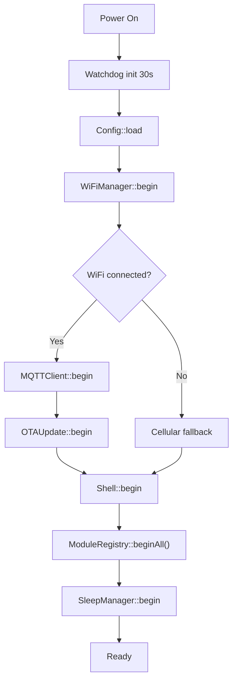

# Overview

## Design Principles

- **Modular** - each sensor or peripheral is a self-contained module
- **Config-driven** - compile-time enables via `thesada_config.h`, runtime values via `config.json` on LittleFS
- **Event-driven** - modules communicate via an internal Event Bus, not direct calls
- **Self-registering** - adding a module means creating files and a `MODULE_REGISTER()` line - nothing else changes
- **Resilient** - automatic WiFi to cellular fallback; MQTT queue survives short disconnects
- **Scriptable** - Lua 5.3 runtime with hot-reloadable rules; no recompile needed for logic changes

---

## Repository Structure

```
thesada-fw/base/
├── platformio.ini                  <- build targets + library deps
├── scripts/
│   ├── generate_manifest.py        <- post-build: build/firmware.json with SHA256 + version
│   └── copy_firmware.py            <- post-build: copies .bin to build/
├── tests/
│   └── test_firmware.py            <- automated + manual test suite (pyserial)
├── src/
│   ├── main.cpp                    <- zero module includes, just beginAll()/loopAll()
│   └── thesada_config.h            <- compile-time module enables + version
├── data/
│   ├── config.json                 <- runtime config (LittleFS)
│   ├── ca.crt                      <- TLS CA cert (required for cert verification)
│   └── scripts/
│       ├── main.lua                <- Lua boot script (runs once at startup)
│       └── rules.lua               <- Lua event rules (hot-reloadable)
└── lib/
    ├── AsyncTCP/                   <- vendored AsyncTCP v3.3.2 (null-PCB crash fixes)
    ├── thesada-core/src/               <- always compiled
    │   ├── Module.h                <- base class (begin/loop/name/status/selftest)
    │   ├── ModuleRegistry.h/.cpp   <- static array, insertion-sort by priority
    │   ├── EventBus.h/.cpp         <- pub/sub between modules
    │   ├── Config.h/.cpp           <- config.json loader (LittleFS)
    │   ├── Log.h/.cpp              <- serial + WebSocket log relay
    │   ├── WiFiManager.h/.cpp      <- multi-SSID, RSSI-ranked, NTP sync
    │   ├── MQTTClient.h/.cpp       <- TLS MQTT, publish queue, MQTT CLI
    │   ├── OTAUpdate.h/.cpp        <- HTTP(S) pull OTA with SHA256 verify
    │   ├── Shell.h/.cpp            <- unified CLI (serial, WS, HTTP, MQTT)
    │   └── SleepManager.h/.cpp     <- deep sleep orchestrator (RTC memory)
    ├── thesada-mod-temperature/src/    <- DS18B20 one-wire sensors
    ├── thesada-mod-ads1115/src/        <- ADS1115 RMS current sensing
    ├── thesada-mod-battery/src/        <- battery monitoring (requires PMU)
    ├── thesada-mod-powermanager/src/   <- AXP2101 PMU, charging, heartbeat LED
    ├── thesada-mod-cellular/src/       <- SIM7080G modem + LTE-M fallback
    ├── thesada-mod-sd/src/             <- SD card CSV logger
    ├── thesada-mod-telegram/src/       <- Telegram Bot API (direct send)
    ├── thesada-mod-httpserver/src/     <- web dashboard, REST API, WS terminal
    ├── thesada-mod-liteserver/src/     <- lightweight HTTP (OTA + config + WiFi setup, CYD)
    ├── thesada-mod-scriptengine/src/   <- Lua 5.3 scripting engine
    ├── thesada-mod-display/src/        <- SSD1306 OLED (Lua-driven rendering)
    ├── thesada-mod-tftdisplay/src/     <- ILI9341 TFT + XPT2046 touch (CYD board)
    └── thesada-mod-pwm/src/            <- PWM output
```

---

## Boot Sequence



`ModuleRegistry::beginAll()` iterates the self-registered module list sorted by priority. `main.cpp` has zero module includes - it just calls `beginAll()` at startup and `loopAll()` each cycle.

---

## Module Base Class

Every module inherits from `Module`:

```cpp
class Module {
public:
  virtual void begin() = 0;
  virtual void loop()  = 0;
  virtual const char* name() = 0;
  virtual void status(ShellOutput out) {}   // for module.status command
  virtual void selftest(ShellOutput out) {} // for selftest command
  virtual ~Module() {}
};
```

Modules self-register using the `MODULE_REGISTER` macro at the bottom of their `.cpp` file:

```cpp
MODULE_REGISTER(TemperatureModule, ModulePriority::SENSOR);
```

**Priority levels** (lower runs first):

| Priority | Value | Examples |
|---|---|---|
| POWER | 10 | PowerManager |
| NETWORK | 20 | Cellular |
| SERVICE | 30 | HttpServer, ScriptEngine |
| SCRIPT | 40 | (reserved) |
| SENSOR | 50 | Temperature, ADS1115, Battery |
| OUTPUT | 60 | Display, TFT, Telegram, PWM |
| LAST | 100 | SD logger |

`ModuleRegistry` uses a static array with insertion sort by priority. `main.cpp` has zero module includes - it calls `ModuleRegistry::beginAll()` and `ModuleRegistry::loopAll()`. Adding a new module means creating the source files and adding a `MODULE_REGISTER` line. Nothing else changes.

All includes use angle brackets (`#include <Log.h>`) instead of relative paths.

---

## Event Bus

Modules never call each other directly. They publish events with a JSON payload and subscribe to events from other modules. The Event Bus is synchronous - subscribers run inline when `publish()` is called.

```cpp
// Publish a temperature reading (in TemperatureModule)
JsonDocument doc;
JsonArray sensors = doc["sensors"].to<JsonArray>();
JsonObject s = sensors.add<JsonObject>();
s["name"]   = "barn_supply";
s["temp_c"] = 18.4;
EventBus::publish("temperature", doc.as<JsonObject>());

// Subscribe (in TelegramModule or any other module)
EventBus::subscribe("temperature", [](JsonObject data) {
  JsonArray sensors = data["sensors"].as<JsonArray>();
  for (JsonObject s : sensors) {
    float temp = s["temp_c"] | -999.0f;
    // react to reading
  }
});
```

**Standard event names and payload schemas:**

| Event | Publisher | Payload |
|---|---|---|
| `temperature` | TemperatureModule | `{ "sensors": [ { "name": "x", "address": "...", "temp_c": 18.4 } ] }` |
| `current` | ADS1115Module | `{ "channels": [ { "name": "x", "voltage_v": 0.012, "raw": 123 } ] }` |
| `battery` | BatteryModule | `{ "present": true, "voltage_v": 3.91, "percent": 35, "charging": false }` |
| `alert` | TelegramModule | `{ "value": "alert message text" }` (MQTTClient and CellularModule subscribe) |
