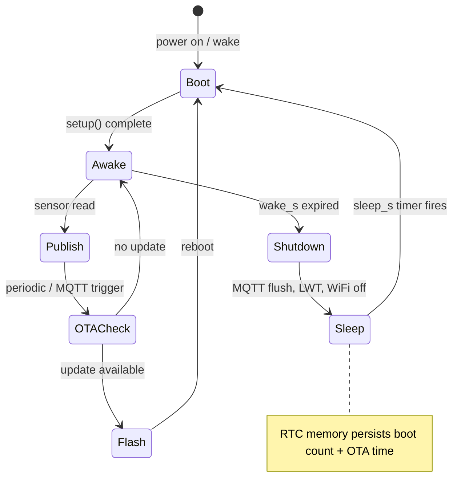

# Power & Sleep

## Power Manager (PowerManager)

`PowerManager` manages the AXP2101 PMU on every boot - VBUS power acceptance, battery charging, ADC enable. Requires `ENABLE_PMU` in config.h. Boards without an AXP2101 (bare ESP32-S3 devkits) can disable this module entirely.

**PMU init - runs unconditionally on every boot:**

| Setting | Value | Reason |
|---|---|---|
| `setVbusVoltageLimit` | 4.36V | Accept power from a dumb USB charger (no data lines / D+D- handshake) |
| `setVbusCurrentLimit` | 1500mA | Allow sufficient input current from wall adapter or solar |
| `disableTSPinMeasure` | - | TS pin (battery temp sensor) is not connected - floating pin causes the PMU to block charging |
| `enableCellbatteryCharge` | - | Explicitly enable the main battery charger circuit |
| `enableBattVoltageMeasure` | - | Required for voltage and percent readings |
| `enableVbusVoltageMeasure` | - | Required for VBUS voltage reading |
| `enableSystemVoltageMeasure` | - | Required for system rail voltage reading |
| `enableBattDetection` | - | Required for `isBatteryConnect()` |

> **Note:** Without `setVbusVoltageLimit` and `setVbusCurrentLimit`, the board will not power on from a wall adapter - only from a PC or powered hub (which negotiate current via USB data lines). This is AXP2101 default behaviour.

> **Note:** `enableCellbatteryCharge()` must be called explicitly. The charger is not auto-enabled after PMU init.

**Battery getters (used by BatteryModule and Shell):**

| Method | Returns |
|---|---|
| `PowerManager::isPmuOk()` | `bool` - PMU I2C init succeeded |
| `PowerManager::isBatteryPresent()` | `bool` - battery connected |
| `PowerManager::getVoltage()` | `float` - battery voltage in V |
| `PowerManager::getPercent()` | `int` - state of charge 0-100, or -1 |
| `PowerManager::isCharging()` | `bool` - charger circuit active |

## Heartbeat LED (HeartbeatLED - core)

The heartbeat LED is always available (core, not a module). It supports two backends:

- **AXP2101 CHGLED** - used automatically when `ENABLE_PMU` is active and PMU init succeeds
- **GPIO pin** - used when PMU is unavailable. Set `heartbeat_pin` in config.json. Negative value = active-low (e.g. `-2` = GPIO2, active low)

| `heartbeat_s` | `heartbeat_pin` | `charging_led` | Behaviour |
|---|---|---|---|
| `>= 5` | any | any | Heartbeat pulse every N seconds (AXP2101 or GPIO) |
| `-1` | any | `true` (default) | AXP2101: hardware charge indicator. GPIO: off |
| `-1` | any | `false` | Always off |

**Pin convention:** positive = active high, negative = active low. `"heartbeat_pin": -2` means GPIO2 where LOW = LED on.

```json
"device": {
  "name":         "thesada-node",
  "heartbeat_s":  5,
  "heartbeat_pin": -2,
  "charging_led": true
}
```

**Implementation:** `HeartbeatLED` lives in `src/core/` (always compiled). Uses `Wire1` (SDA=15 SCL=7) for AXP2101 path - independent of `Wire` (I2C bus 0, used by ADS1115). No RTOS tasks or timers; LED state is managed in `loop()`.

Reference: [Xinyuan-LilyGO/LilyGo-T-SIM7080G](https://github.com/Xinyuan-LilyGO/LilyGo-T-SIM7080G) examples (MIT licence).

---

## Deep Sleep (SleepManager)



`SleepManager` orchestrates a wake/sleep cycle for battery-powered deployments. When enabled, the device stays awake for `wake_s` seconds (takes readings, publishes to MQTT, handles OTA), then enters ESP32 deep sleep for `sleep_s` seconds. Deep sleep resets the CPU - on wake, the full boot sequence runs from `setup()`.

**Config:**
```json
"sleep": {
  "enabled": false,
  "sleep_s": 300,
  "wake_s":  30
}
```

- `sleep_s` minimum: 10 seconds
- `wake_s` minimum: 10 seconds
- Default: disabled (continuous operation)

**RTC memory** (persists across deep sleep, cleared on power cycle):
- `bootCount` - increments on every wake
- `lastOtaCheck` - UTC epoch of last OTA manifest check

**OTA awareness:** When sleep is enabled, `OTAUpdate` uses wall clock time (NTP) + the RTC-persisted last check time instead of `millis()` (which resets on every wake). OTA only checks when the configured interval has actually elapsed in real time.

**Graceful shutdown sequence:**
1. Publish `"sleeping"` to `<prefix>/status` via MQTT
2. Flush MQTT queue (20 iterations x 50ms)
3. Disconnect WiFi
4. Configure RTC timer wake source
5. Enter `esp_deep_sleep_start()`

**Shell command:**
```
sleep
  Sleep: enabled  boot #6
    wake 30s  sleep 300s
    last OTA check: 1774306670
```
